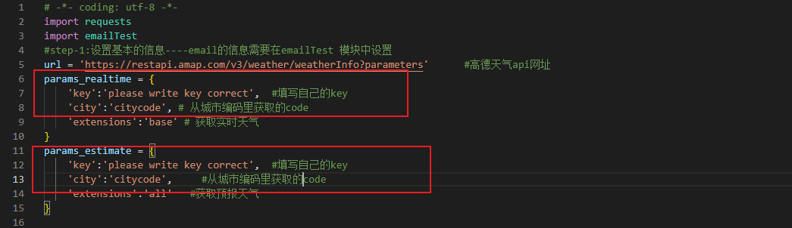
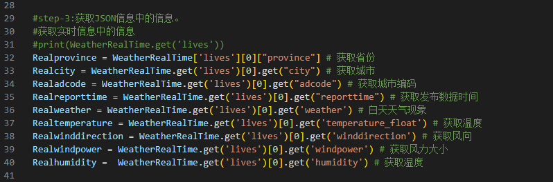
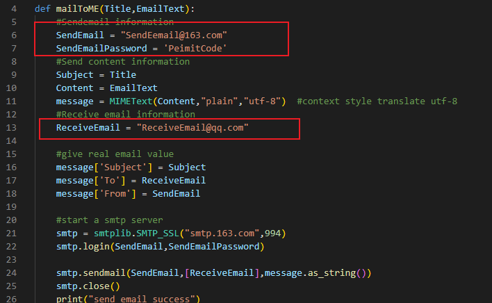

#              高德weather定时获取并邮件通知

### Brief：

  天气通知脚本，从高德天气api获取天气，进行分析温差和天气状况，从而采用QQ邮件通知并微信直接查看。

### Need：

  1-注册高德开发者账号，并获取天气api接口

  2-一个接收的qq邮箱账号、一个发送的网易云163.com邮箱账号

  3-一个服务器或者树莓派，系统可运行python3环境

### 1.0：api获取天气信息：

step1:天气api准备

注册高德账号：https://lbs.amap.com/

高德天气api官方介绍：https://lbs.amap.com/api/webservice/guide/api/weatherinfo/

高德key获取步骤： [高德地图api接口免费查询天气实战案例，axios请求查询天气，js版，【接上一篇微信测试号推送纪念日】_高德天气api使用_阿民不加班的博客-CSDN博客](https://blog.csdn.net/qq_51055690/article/details/126885110) 

step-2：

  正确填写**weatherGaide.py**中的key和citycode（城市的citycode可在docs/文件夹中查看）



step-3：根据JSON格式，会调用获取自己想要的信息，具体JSON信息可参考docs/weatherJSON和相关代码调用。



### 2.0：邮件通知设置：

根据自己的情况，将接收邮箱和发送邮件，以及smtp所需的peimitcode 填入**emailTest.py**代码中：

参考视频： [python 发消息到微信 简单脚本 自动化 实例 实战 python 发通知 发微信 发信息 发邮件_哔哩哔哩_bilibili](https://www.bilibili.com/video/BV1SG4y1o7rr/?buvid=XY7176C7DEBB916D51D26698F7B7FD343F99A&from_spmid=playlist.playlist-detail.0.0&is_story_h5=false&mid=uTG7Zp%2B8o0PTzVNGDFZhew%3D%3D&p=1&plat_id=116&share_from=ugc&share_medium=android&share_plat=android&share_session_id=fd12985f-8930-4166-94ef-99550ab5028c&share_source=WEIXIN&share_tag=s_i&spmid=united.player-video-detail.0.0&timestamp=1699178729&unique_k=ylAIAtF&up_id=194598820&vd_source=d6cbfce424d90414a859cc5aee71d89e)  



### 3.0：linux环境下定时任务 crontab

 **crontab（cron）是linux环境下常用定时运行任务的软件，一般默认安装无需手动安装**

step-1：查看是否有crontab：

```
  systemctl status cron
```

step-2：ubuntu下安装crontab：

```
sudo apt-get update 

sudo apt-get install cron 
```

step-3：编译crontab文件，创建定时任务并查看编辑结果：

```
ctontab -e #编辑
ctontab -l #查看
```

step-4：启动并查看状态：

```
sudo systemctl start cron

sudo systemctl status cron 
```

example：举例，每天23：00启动，运行python脚本并且将输出信息放在log.txt文件中。


tips：对于crontab中定时的具体设定，可查看下面的文章以及视频

https://www.moerats.com/archives/286/    #文章

[定时执行python脚本_哔哩哔哩_bilibili](https://www.bilibili.com/video/BV1KJ411h76R/?buvid=XY7176C7DEBB916D51D26698F7B7FD343F99A&from_spmid=playlist.playlist-detail.0.0&is_story_h5=false&mid=uTG7Zp%2B8o0PTzVNGDFZhew%3D%3D&p=1&plat_id=116&share_from=ugc&share_medium=android&share_plat=android&share_session_id=c7eda97c-390b-4fa5-bb8a-d122ba0aac1b&share_source=WEIXIN&share_tag=s_i&spmid=united.player-video-detail.0.0&timestamp=1699178744&unique_k=3RsUIDV&up_id=254479550)     #crontab使用说明


### Issue：

1-pip install email 出错？

```
       note: This error originates from a subprocess, and is likely not a problem with pip. 
       error: metadata-generation-failed × Encountered error while generating package metadata. 
```

answer：最终用 pip install email --pre 解决，同时不要将文件命名和库的名字重叠!!!!具体可看以下博客：

https://stackoverflow.com/questions/74397049/metadata-generation-failed-when-trying-to-install-pygame

https://sebhastian.com/error-metadata-generation-failed/

2-QQ邮箱无法接收到了邮件？

answer： 可能会被误判为垃圾邮件，建议把发送邮件在QQ邮箱中创建为联系人。